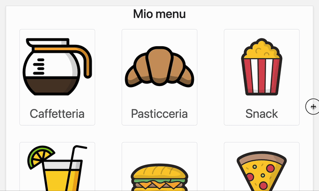
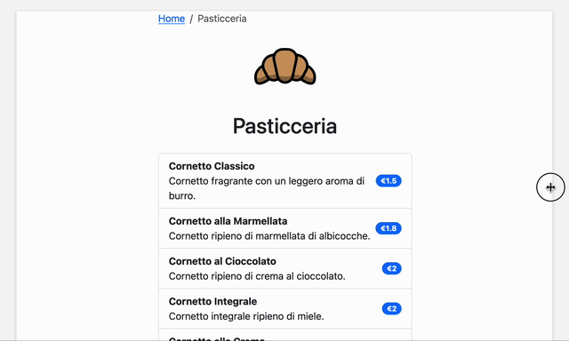
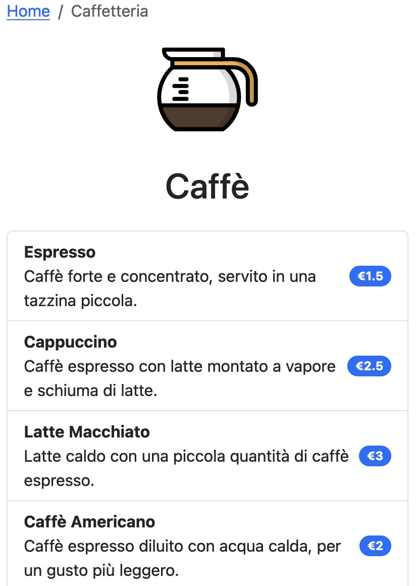
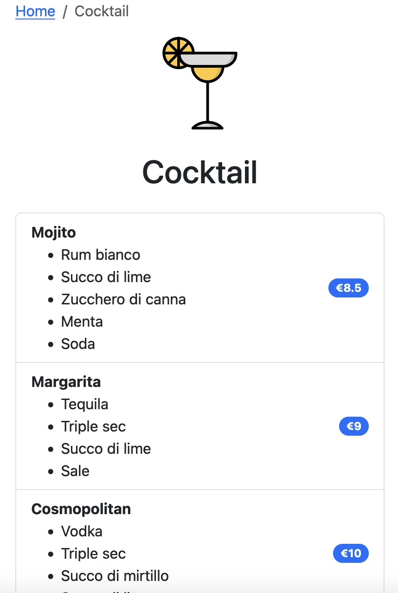

# Menu

**ATTENZIONE: NON È NECESSARIO CHE IL SITO RISULTANTE SIA ESTETICAMENTE UGUALE A QUELLO DELLE IMMAGINI**

Un menu di un ristorante è diviso in 10 categorie, per ciascuna delle quali ci è stato fornita una immagine e un file json. Inoltre c'è un file JSON per il menu principale.

Vogliamo creare un menu online tipo [questo](https://web.menuadesso.com/acquadolcesailing/multi-menu?language=503&menu=1780) usando `Bootstrap`.

La prima pagina del menu (che si baserà sul filme `menu.json`) presenterà le nove categorie in una griglia _responsive_:

Anche le singole pagine delle categorie (che si baseranno sui rispettivi file JSON) sono _responsive_. Su schermi grandi, la lista dei prodotti occuperà una parte della pagina, per motivi di leggibilità. Sotto una certa soglia invece si espanderà ad occupare tutto lo spazio disponibile:

Da notare che alcune categorie (tipo `Caffetteria`) contengono un campo `description`, mentre altre (tipo `Cocktail`) contengono un campo `ingredients`:

**N.B: cercare di ottimizzare il codice utilizzando il più possibile funzioni generiche.**